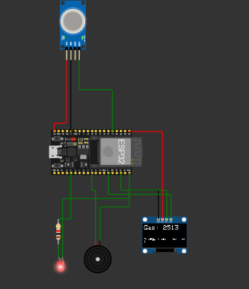

# 🔥 SmokeSentry – Smart Smoke Detector (ESP32 + MQ-2 + OLED)

**SmokeSentry** is a smart smoke detection simulation using the ESP32 microcontroller, MQ-2 gas sensor, OLED display, LED, and buzzer. It alerts users when dangerous smoke levels are detected — all simulated in Wokwi with no physical hardware needed.

---

## 🧠 Features

- 📈 Real-time gas/smoke level readings
- 🖥️ OLED display showing gas level and air quality
- 🔴 LED alert when gas crosses the threshold
- 🔊 Buzzer sound for smoke warning
- 🧪 Fully simulated using Wokwi (free plan)

---

## 🧰 Components Used (Simulated in Wokwi)

| Component | Description |
|----------|-------------|
| ESP32    | Microcontroller |
| MQ-2     | Gas/Smoke Sensor |
| SSD1306  | OLED Display (I2C) |
| LED      | Alert Indicator |
| Buzzer   | Sound Alert |

---

## 🖼️ Preview

---

## 💡 How It Works

- MQ-2 reads analog gas concentration
- If gas level > threshold:
  - LED and Buzzer turn on
  - OLED shows **"⚠️ Smoke Detected!"**
- Otherwise:
  - Displays **"✅ Air is Clean"**
- All activity is logged to the Serial Monitor

---

## 🔗 Wokwi Simulation

👉 [Try it Live on Wokwi] (https://wokwi.com/projects/436560716488364033)

---

## 📂 Files Included

- `SmokeSentry.ino` – Main Arduino sketch
- `diagram.json` – Wokwi wiring configuration
- `preview.png` – OLED output screenshot
- `README.md` – This project overview

---

## ✅ Status

🚀 Fully functional and simulated on Wokwi  
🔜 Planned upgrade: IoT version with Firebase and Telegram alerts (hardware needed)

---

## 📬 Contact

Made with ❤️ by [YourGitHubUsername](https://wokwi.com/dashboard/projects)
